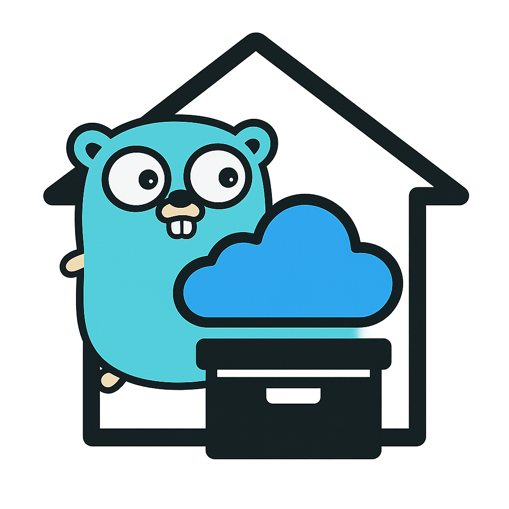

<h1>
<p align="center">
  
  <br>Home Object Storage
</h1>
  <p align="center">Object storage with simple design, configurable replication, and encryption</p>
</p>


---

## About

HOS is an object storage system designed for home use. While there are
many excellent object storage solutions available, they are all designed
for much more complicated use cases, and are complicated to use. HOS is designed
to be easy to use.

HOS has configurable replication count, encryption at rest, and flexibility
to run a mix of devices, including low-powered ones. You can have
clusters of one or many servers, on the same computer or on different computers.

HOS servers know nothing about other servers and handle only requests to themselves.
Cluster information is kept on the client side. Replication and distribution are
handled by the client. The client simply makes simultaneous requests to all the relevant servers.

Servers keep data as files and directories, and metadata as extended attributes.
Metadata is also kept in a database.


## Architecture

- **Server (`hosd`)**: Storage server that manages local storage and metadata.
  Servers create their own CA certificate and generate server certificates from
  their CA every time the server starts. It is not required but recommended to
  run a server per disk drive.

- **Client (`hos`)**: Command-line interface for interacting with HOS clusters.
  The client gets the server CA when added to the configuration and communicates
  with servers over TLS.

- **Pools**: Logical containers for objects, similar to S3 buckets. Pools are
  created on all servers regardless of replication count.

- **Objects**: Individual files stored in pools. Objects are uploaded to servers
  depending on the pool's replication count. Encryption is set at the pool level, and
  objects created under encrypted pools are encrypted at rest.

- **Users**: Authentication uses Ed25519 public/private key pairs similar to SSH.
  Users manage their own private keys locally, while the `admin` user controls
  which public keys are authorized to access the servers.

- **Keys**: Server encryption keys. Every server has one randomly generated encryption
  key. The key can be unlocked with multiple passwords. The encryption key is mutated for
  every object encryption.

- **Clusters**: Logical groups of servers that work together

## Installation

### Build from Source

```bash
git clone https://github.com/brlbil/hos.git
cd hos
go build -o hos ./cmd/hos
go build -o hosd ./cmd/hosd
```

## Quick Start

### 1. Start the Server or Servers

```bash
# Start HOS server daemon as many as desired
hosd /path/to/storage
```

### 2. Initialize a Cluster

```bash
# Initialize a new HOS cluster
hos init 10.10.10.1:1981 10.10.10.2:1981

# This will:
# - Create admin user configuration
# - Configure default cluster settings
```


### 3. Create Your First Pool

```bash
# Create a pool for storing files
hos make-pool Documents

# Create an encrypted pool with replication
hos mkp --encrypted --replica-count 2 Photos
```

### 4. Upload Files

```bash
# Upload files to a pool
hos upload file1.txt file2.pdf Documents

# Upload directory recursively
hos up -R ./photos/ Photos
```

### 5. Browse and Download

```bash
# List pools
hos list

# List objects in a pool
hos list Documents

# Download an object to the current directory
hos dn Documents/file1.txt
```

## Usage Examples

### Pool Management

```bash
# Create pools
hos mp Movies
hos mp --encrypted --replica-count 3 Documents

# Link pools (create aliases)
hos link Documents Docs

# Set pool attributes
hos attr Documents Backup='{"Enabled": true}'

# Manage permissions
hos perm Documents user1:rw user2:r
```

### Object Operations

```bash
# Upload with labels
hos upload --label "project=web" --label "type=asset" ./assets/* WebAssets

# Download with filtering
hos download --label "project=web" WebAssets ./local-assets/

# Move objects between pools
hos move WebAssets/old-logo.png Archives/logos/

# Remove objects
hos rm WebAssets/unused-file.jpg
```

### User Management (Admin only)

```bash
# Add users to cluster
hos user add newuser

# List users
hos user list

# Remove users
hos user remove olduser
```

### Encryption Key Management

```bash
# List encryption keys
hos key list

# Backup keys to archive
hos key backup keys-backup.tar.gz

# Restore keys from archive
hos key restore signature123 keys-backup.tar.gz
```

### Web Interface

```bash
# Start web interface on port 8998
hos exp html

# Access via browser: http://localhost:8998
```

### FUSE Mounting

```bash
# Mount all pools
hos exp mount /mnt/hos

# Mount specific pools
hos exp mount Documents Pictures /mnt/hos

# Mount with specific pool ID
hos exp mount --id pool-id-123 /mnt/pool
```

### Storage Layout

```
/data-dir/
├── .db/hos.db            # Database
├── .certs/               # Server certificates
│   ├── ca.pem
│   └── key.pem
├── .keys/                # Encryption keys
│   ├── key-id-1
│   └── key-id-2
├── user-id-1             # User file (metadata in xattrs)
├── user-id-2
├── pool-id-1/            # Pool directory (metadata in xattrs)
│   ├── object-id-1       # Object file (metadata in xattrs)
│   └── object-id-2
└── pool-id-2/
    └── object-id-3
```

## License

This project is licensed under the MIT License - see the [LICENSE](LICENSE) file for details.

## Roadmap
These are possible enhancements

- [ ] Copy between servers and clusters
- [ ] File Sync
- [ ] Web Application

> [!WARNING]
>
> This is alpha level software, everything is open to change. The software has been in use
> but user base is limited, there are many edge cases and no guarantees against data loss.
